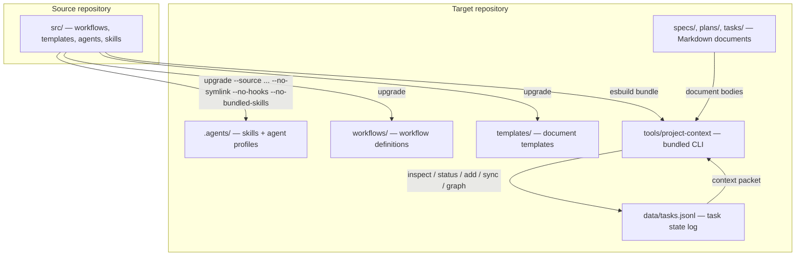
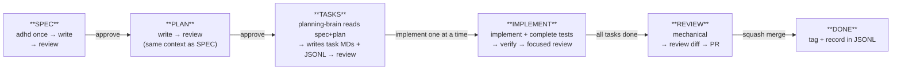
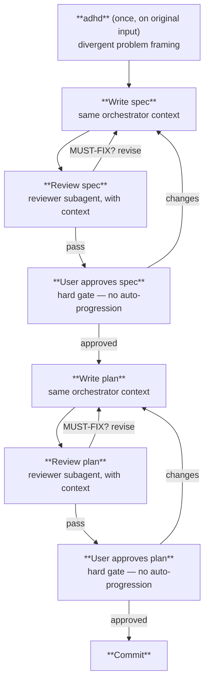
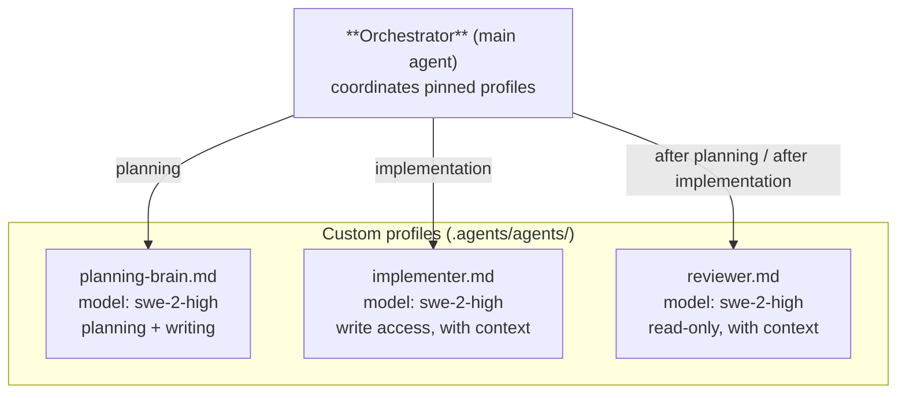

# Project Context

[](https://www.npmjs.com/package/@bperin/project-context-protocol)
[](https://github.com/bperin/project-context/pkgs/npm/project-context-protocol)
[](https://github.com/bperin/project-context/actions/workflows/release.yml)
[](https://opensource.org/licenses/MIT)

A Git-backed project management and context protocol for AI coding
agents. Project Context gives an existing codebase a durable,
structured source of truth for specs, plans, tasks, architecture,
decisions, and workflows — with review pipelines that pressure-test
every document before it ships.

## Install

```bash
# From npm
npm install -g @bperin/project-context-protocol

# From GitHub Packages
npm install -g @bperin/project-context-protocol --registry=https://npm.pkg.github.com

# Run without installing
npx @bperin/project-context-protocol --help

# Or download the self-contained bundle from the latest release
# https://github.com/bperin/project-context/releases/latest
```

The bundled CLI (no `node_modules` needed) is also available as a
build artifact from every CI run and as a release asset on every
semantic-release tag.

## Nightly builds

A nightly CI run checks for new commits since the last release. If
there are changes, it bundles the CLI and uploads it as a
`project-context-nightly` artifact (7-day retention). Download from
the [Actions tab](https://github.com/bperin/project-context/actions)
— filter by the "Nightly Build" workflow.

## How it works



JSONL files (`data/tasks.jsonl`) hold task state as an append-only event
log. Markdown documents hold prose, requirements, acceptance criteria,
and implementation detail. Specs and plans carry status in their Markdown
front-matter; tasks carry status in the JSONL event log.

## Workflow lifecycle

The orchestrator runs the planning workflow in one continuous context:
divergent ideation (`adhd`) once on the original input, then write spec,
review, write plan, review. A separate planning-brain then converts the
approved plan into task Markdown files and JSONL records.



Planning and review remain gated and serial. Task analysis and implementation may
use the bounded parallel waves described below.

## Planning workflow

The orchestrator uses one continuous high-context process for spec and
plan creation. `adhd` runs once, on the original user input, to frame the
problem. The same context then writes the spec, dispatches the reviewer,
writes the plan, and dispatches the reviewer. No optimizer or research
subagents run during planning.



One review pass per artifact. If MUST-FIX issues remain after one
revision, escalate to the user.

## Model rotation

Custom subagent profiles are pinned to specific models via the `model:` field in
their definition files. The root `.agents` symlink exposes the canonical
workspace profiles from `.agents/agents/`. Project-context does not duplicate
them under `.devin/agents/`; that directory remains available for unrelated
user-owned Devin profiles.

| Profile          | Model        | Role                                            | Fires when                                   |
| ---------------- | ------------ | ----------------------------------------------- | -------------------------------------------- |
| `planning-brain` | `swe-2-high` | Think (ADHD) + write specs, plans, tasks, JSONL | All planning phases                          |
| `implementer`    | `swe-2-high` | Write code + complete task-level tests          | Task implementation                          |
| `reviewer`       | `swe-2-high` | Fast focused review, fixes issues directly      | After planning-brain, all creation workflows |

The root agent is a lightweight orchestrator. All pinned subagent
profiles use `swe-2-high`. The workflow never uses `subagent_general`,
which would inherit the root model.

## Subagent architecture



Implementation may run up to three pinned `swe-2-high` implementers in
the background when tasks are dependency-ready and have disjoint write
sets. Reviews, commits, and project-state updates remain serial.
Subagents receive context packets (not conversation history) built by
the CLI. Each packet contains the target entity, parent, children,
modules, components, and cascaded skills.

## Workflow skills

The `pc-*` skills are the user-facing slash commands that drive the
workflow. They live in `.agents/skills/` and are discovered by Devin.

| Command               | Purpose                                                                                          |
| --------------------- | ------------------------------------------------------------------------------------------------ |
| `/pc-epic`            | Write a high-level epic from a vision — planning-brain loads adhd, planning-brain writes, review |
| `/pc-spec`            | Run the planning workflow — adhd once, write spec, review, write plan, review                    |
| `/pc-create-tasks`    | Run the planning-brain workflow — read spec+plan, write task MDs + JSONL                         |
| `/pc-implement`       | Implement + complete tests → verify → one focused review; optimizer only when warranted          |
| `/pc-review`          | Run the PR review workflow — mechanical checks, dispatch reviewer, open PR                       |
| `/pc-inspect-project` | Read project state and print specs/plans/tasks with status                                       |
| `/pc-context`         | Build a context packet for a spec/plan/task                                                      |
| `/pc-uuid`            | Generate a deterministic UUID from an ID                                                         |

## Commands

```bash
# Scaffold a new workspace (do NOT run against existing repos with data)
project-context init -t <target> [--discover] [-w <workspace>]

# Inspect project state
project-context inspect -t .

# Refresh project overview from workflow .md files
project-context overview -t .

# Build graph nodes and edges from source files
project-context graph -t .

# Build a context packet for a spec/plan/task
project-context context PLAN-003 -t . -o packet.json

# Add a new spec/plan/task (creates MD file, appends to JSONL for tasks)
project-context add --type plan --title "Title" --parent SPEC-001 -t .

# Update status (updates MD file, appends to JSONL for tasks)
project-context status PLAN-003 committed -t .
project-context ready --limit 3 -t .             # select ready, non-overlapping tasks

# Sync task→plan and plan→spec status rollups
project-context sync -t .

# Archive a done/superseded record (moves MD to archive/, appends JSONL event)
project-context archive TASK-014 -t .
project-context archive --status done -t .        # archive all terminal records
project-context archive PLAN-003 -t . --force      # override safeguards

# Inspect (archived records hidden by default)
project-context inspect -t . --include-archived

# Safe asset synchronization (workflows, templates, skills, agent profiles)
project-context upgrade -t . \
  --source /path/to/project-context/src \
  --no-symlink --no-hooks --no-bundled-skills
```

### Safe upgrade

`upgrade` synchronizes generated assets from the source repository
while preserving workspace data. It copies:

- workflows → `workflows/`
- skills → `.agents/skills/`
- agent profiles → `.agents/agents/`
- templates → `templates/`

The `--no-symlink`, `--no-hooks`, and `--no-bundled-skills` flags
prevent unwanted side effects:

- `--no-symlink` — don't create a `.agents` symlink at the project root
- `--no-hooks` — don't create `.devin/hooks.v1.json`
- `--no-bundled-skills` — don't copy language/implementation skills
  into the workflow workspace (they belong at the repo root or
  user-level)

`upgrade` also removes obsolete assets from older versions:
`overview.xlsx`, old workflow files (`spec-creation.md`, etc.), old
skill directories (unprefixed names), old agent profiles
(`spec-optimizer.md`, `plan-optimizer.md`, `task-optimizer.md`), and
stale templates.

## Archive

Old specs, plans, and tasks accumulate over time. `archive` moves
terminal records (`done` / `superseded`) out of the active
`specs/`, `plans/`, and `tasks/` directories into an `archive/` tree,
keeping active work focused on what's in flight.

```text
.{reponame}-manager/
└── archive/
    ├── specs/        # archived SPEC-NNN.md
    ├── plans/        # archived PLAN-NNN.md
    ├── tasks/        # archived TASK-NNN.md
    ├── timelines/   # archived PLAN-NNN.timeline.jsonl
    └── archive.jsonl # append-only audit log of archive events
```

Behavior:

- **Terminal-only by default.** Only `done` or `superseded` records
  can be archived. Use `--force` to override.
- **Children first.** A spec/plan with active children is refused
  until the children are archived (or `--force`).
- **Append-only history.** `data/tasks.jsonl` is never rewritten.
  Archiving a task appends an `archived` event. Plan timelines move
  to `archive/timelines/` when their plan is archived.
- **Hidden from active views.** `inspect` hides archived records by
  default; `--include-archived` surfaces them. `sync` skips archived
  records so they don't roll up into parent status.

## Directory structure

```text
target repository/
├── .ai-trust/                      # durable workspace
│   ├── AGENTS.md                   # workflow protocol (generated)
│   ├── .agents/
│   │   ├── AGENTS.md               # shared skill instructions (generated)
│   │   ├── agents/                 # subagent profiles (generated)
│   │   │   ├── planning-brain.md
│   │   │   ├── reviewer.md
│   │   │   └── implementer.md
│   │   └── skills/                 # pc-* workflow skills (generated)
│   ├── workflows/                  # workflow definitions (generated)
│   ├── templates/                  # document templates (generated)
│   ├── specs/                      # spec documents (authored)
│   ├── plans/                      # plan documents (authored)
│   ├── tasks/                      # task documents (authored)
│   ├── data/                       # JSONL + JSON state files
│   │   ├── tasks.jsonl             # task event log (append-only)
│   │   ├── identity.json           # project identity
│   │   ├── skills.json            # skill registry + matrix
│   │   └── decisions.json         # ADR index
│   ├── decisions/                  # ADRs and research findings
│   └── architecture/              # architecture docs
└── tools/
    └── project-context             # bundled CLI (esbuild, self-contained)
```

## Bundled CLI

The CLI is bundled with esbuild into a single self-contained file.
This eliminates the need for `node_modules` or an external checkout:

```bash
npm run bundle
# or
npx esbuild bin/cli.js --bundle --platform=node --format=cjs \
  --outfile=dist/project-context --keep-names
chmod +x dist/project-context
```

Check the version:

```bash
node dist/project-context --version
```

The release workflow (`.github/workflows/release.yml`) automates
bundling on every merge to `main`. The bundle is uploaded as a GitHub
release asset and as a CI artifact. Target repos download it and
place it in their `tools/` directory.

## Versioning

This project uses [semantic-release](https://semantic-release.gitbook.io/)
with [conventional commits](https://www.conventionalcommits.org/).
Version bumps are automatic based on commit messages:

| Commit type                                       | Version bump |
| ------------------------------------------------- | ------------ |
| `feat:`                                           | minor        |
| `fix:`, `perf:`                                   | patch        |
| `feat!:` or `BREAKING CHANGE:`                    | major        |
| `docs:`, `chore:`, `style:`, `test:`, `refactor:` | none         |

A `CHANGELOG.md` is generated automatically with each release.

## Source repository layout

```text
project-context/
├── bin/cli.js                      # CLI entry point
├── src/
│   ├── agents/                     # subagent profile source
│   │   ├── planning-brain.md       #   model: swe-2-high
│   │   ├── reviewer.md             #   model: swe-2-high
│   │   └── implementer.md          #   model: swe-2-high
│   ├── commands/                   # CLI commands
│   │   ├── init.js
│   │   ├── inspect.js
│   │   ├── overview.js
│   │   ├── context.js
│   │   ├── add.js
│   │   ├── status.js
│   │   ├── sync.js
│   │   ├── upgrade.js
│   │   └── shared.js
│   ├── skills/                     # pc-* workflow skill source
│   ├── templates/                  # document template source
│   └── workflows/                  # workflow definition source
├── test/                           # test suite
├── package.json
└── AGENTS.md                       # development workflow for this repo
```

## Development

```bash
# Install dependencies
npm install

# Run tests
npm test

# Bundle the CLI
npx esbuild bin/cli.js --bundle --platform=node --format=cjs \
  --outfile=dist/project-context --keep-names
```

## Core invariant

Project Context is the source of truth. Graph and semantic indexes are
derived views. Agents consume compiled context packets rather than
reconstructing the project from scratch.
