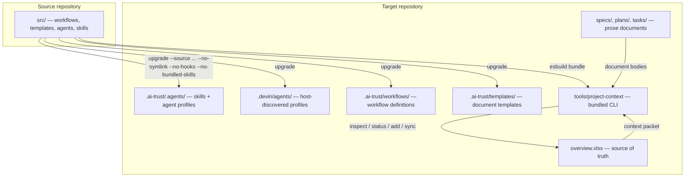
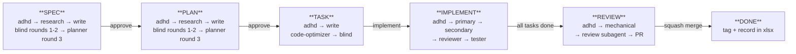
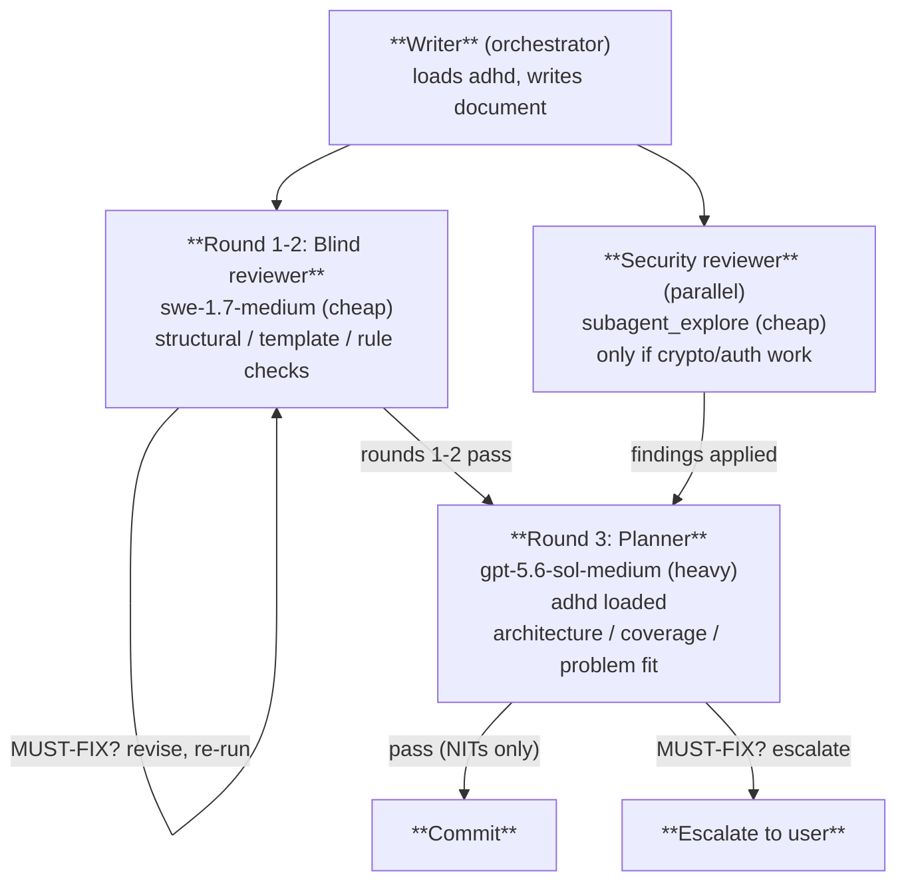
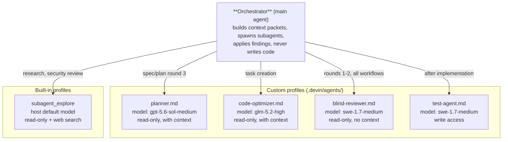

# Project Context

[](https://www.npmjs.com/package/@bperin/project-context-protocol)
[](https://github.com/bperin/project-context/pkgs/npm/project-context-protocol)
[](https://github.com/bperin/project-context/actions/workflows/release.yml)
[](https://opensource.org/licenses/MIT)

A Git-backed project management and context protocol for AI coding
agents. Project Context gives an existing codebase a durable,
structured source of truth for specs, plans, tasks, architecture,
decisions, and workflows — with review pipelines that pressure-test
every document before it ships.

## Install

```bash
# From npm
npm install -g @bperin/project-context-protocol

# From GitHub Packages
npm install -g @bperin/project-context-protocol --registry=https://npm.pkg.github.com

# Run without installing
npx @bperin/project-context-protocol --help

# Or download the self-contained bundle from the latest release
# https://github.com/bperin/project-context/releases/latest
```

The bundled CLI (no `node_modules` needed) is also available as a
build artifact from every CI run and as a release asset on every
semantic-release tag.

## Nightly builds

A nightly CI run checks for new commits since the last release. If
there are changes, it bundles the CLI and uploads it as a
`project-context-nightly` artifact (7-day retention). Download from
the [Actions tab](https://github.com/bperin/project-context/actions)
— filter by the "Nightly Build" workflow.

## How it works



The `overview.xlsx` workbook is the source of truth for structured
data (IDs, UUIDs, statuses, dependencies, skills). Markdown documents
hold prose, requirements, acceptance criteria, and implementation
detail. The workbook indexes the documents; the documents provide the
substance.

## Workflow lifecycle

Every workflow starts with the `adhd` skill for divergent ideation,
regardless of which model runs the steps.



## Tiered review (credit-efficient)

Spec and plan creation use a tiered review pattern: cheap models catch
structural issues first, then a heavy model fires once for deep
architecture review.



This cuts heavy-model calls from 6 per spec+plan pair to 1.

## Model rotation

Custom subagent profiles are pinned to specific models via the `model:`
field in their definition files. Profiles are discovered from
`.devin/agents/` at the project root.

| Profile | Model | Role | Fires when |
|---------|-------|------|------------|
| `planner` | `gpt-5.6-sol-medium` | Spec/plan architecture review | Round 3 only |
| `code-optimizer` | `glm-5.2-high` | Task implementation review | Task creation |
| `blind-reviewer` | `swe-1.7-medium` | Rules compliance, no context | Rounds 1-2, every workflow |
| `test-agent` | `swe-1.7-medium` | Test suite writing | After implementation |
| research/security | `subagent_explore` (host default) | Research, security review | Background, cheap |

## Subagent architecture



Subagents receive context packets (not conversation history) built by
the CLI. Each packet contains the target entity, parent, children,
modules, components, and cascaded skills.

## Commands

```bash
# Scaffold a new workspace (do NOT run against existing repos with data)
project-context init -t <target> [--discover] -w <workspace>

# Inspect the workbook
project-context inspect -w .ai-trust -t .

# Refresh the Workflows sheet from workflow .md files (preserves all other sheets)
project-context overview -w .ai-trust -t .

# Build a context packet for a spec/plan/task
project-context context PLAN-003 -w .ai-trust -t . -o packet.json

# Add a new spec/plan/task row
project-context add --type plan --title "Title" --parent SPEC-001 -w .ai-trust -t .

# Update status
project-context status PLAN-003 committed -w .ai-trust -t .

# Sync task→plan and plan→spec status rollups
project-context sync -w .ai-trust -t .

# Safe asset synchronization (workflows, templates, skills, agent profiles)
project-context upgrade -w .ai-trust -t . \
  --source /path/to/project-context/src \
  --no-symlink --no-hooks --no-bundled-skills
```

### Safe upgrade

`upgrade` synchronizes generated assets from the source repository
while preserving workbook data. It copies:

- workflows → `.ai-trust/workflows/`
- skills → `.ai-trust/.agents/skills/`
- agent profiles → `.ai-trust/.agents/agents/` **and** `.devin/agents/`
- templates → `.ai-trust/templates/`

The `--no-symlink`, `--no-hooks`, and `--no-bundled-skills` flags
prevent unwanted side effects:

- `--no-symlink` — don't create a `.agents` symlink at the project root
- `--no-hooks` — don't create `.devin/hooks.v1.json`
- `--no-bundled-skills` — don't copy language/implementation skills
  into the workflow workspace (they belong at the repo root or
  user-level)

Agent profiles are copied to `.devin/agents/` (without generated
headers) so the Devin host discovers them as custom subagent
profiles with their pinned models.

## Directory structure

```text
target repository/
├── .ai-trust/                      # durable workspace
│   ├── overview.xlsx               # source of truth (structured data)
│   ├── AGENTS.md                   # workflow protocol (generated)
│   ├── .agents/
│   │   ├── AGENTS.md               # shared skill instructions (generated)
│   │   ├── agents/                 # subagent profiles (generated)
│   │   │   ├── planner.md
│   │   │   ├── code-optimizer.md
│   │   │   ├── blind-reviewer.md
│   │   │   └── test-agent.md
│   │   └── skills/                 # workflow skills (generated)
│   ├── workflows/                  # workflow definitions (generated)
│   ├── templates/                  # document templates (generated)
│   ├── specs/                      # spec documents (authored)
│   ├── plans/                      # plan documents (authored)
│   ├── tasks/                      # task documents (authored)
│   ├── decisions/                  # ADRs and research findings
│   └── architecture/              # architecture docs
├── .devin/
│   └── agents/                     # host-discovered subagent profiles
│       ├── planner.md
│       ├── code-optimizer.md
│       ├── blind-reviewer.md
│       └── test-agent.md
└── tools/
    └── project-context             # bundled CLI (esbuild, self-contained)
```

## Bundled CLI

The CLI is bundled with esbuild into a single self-contained file.
This eliminates the need for `node_modules` or an external checkout:

```bash
npm run bundle
# or
npx esbuild bin/cli.js --bundle --platform=node --format=cjs \
  --outfile=dist/project-context --keep-names
chmod +x dist/project-context
```

Check the version:

```bash
node dist/project-context --version
```

The release workflow (`.github/workflows/release.yml`) automates
bundling on every merge to `main`. The bundle is uploaded as a GitHub
release asset and as a CI artifact. Target repos download it and
place it in their `tools/` directory.

## Versioning

This project uses [semantic-release](https://semantic-release.gitbook.io/)
with [conventional commits](https://www.conventionalcommits.org/).
Version bumps are automatic based on commit messages:

| Commit type | Version bump |
|-------------|-------------|
| `feat:` | minor |
| `fix:`, `perf:` | patch |
| `feat!:` or `BREAKING CHANGE:` | major |
| `docs:`, `chore:`, `style:`, `test:`, `refactor:` | none |

A `CHANGELOG.md` is generated automatically with each release.

## Source repository layout

```text
project-context/
├── bin/cli.js                      # CLI entry point
├── src/
│   ├── agents/                     # subagent profile source
│   │   ├── planner.md              #   model: gpt-5.6-sol-medium
│   │   ├── code-optimizer.md       #   model: glm-5.2-high
│   │   ├── blind-reviewer.md       #   model: swe-1.7-medium
│   │   └── test-agent.md           #   model: swe-1.7-medium
│   ├── commands/                   # CLI commands
│   │   ├── init.js
│   │   ├── inspect.js
│   │   ├── overview.js
│   │   ├── context.js
│   │   ├── add.js
│   │   ├── status.js
│   │   ├── sync.js
│   │   ├── upgrade.js
│   │   └── shared.js
│   ├── skills/                     # workflow skill source
│   ├── templates/                  # document template source
│   └── workflows/                  # workflow definition source
├── test/                           # test suite
├── package.json
└── AGENTS.md                       # development workflow for this repo
```

## Development

```bash
# Install dependencies
npm install

# Run tests
npm test

# Bundle the CLI
npx esbuild bin/cli.js --bundle --platform=node --format=cjs \
  --outfile=dist/project-context --keep-names
```

## Core invariant

Project Context is the source of truth. Graph and semantic indexes are
derived views. Agents consume compiled context packets rather than
reconstructing the project from scratch.
