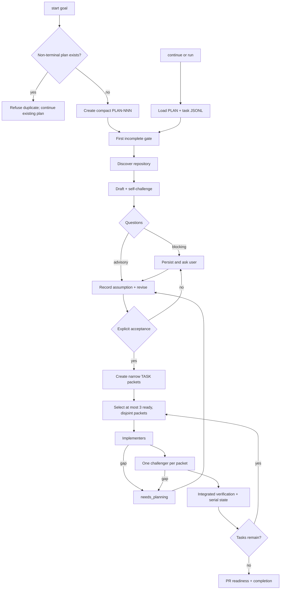

# Workflow Overview

The generated user surface is one skill:

```text
/pc-plan start <goal>
/pc-plan continue [PLAN-NNN]
/pc-plan status [PLAN-NNN]
/pc-plan run [PLAN-NNN]
```

`pc-plan` restores all state from `PLAN-NNN.md` and append-only task JSONL.
Low-level commands remain internal mechanics.



## Durable model

```text
PLAN-NNN
└── TASK-NNN
```

Only one plan may be non-terminal. The root planning agent owns discovery,
questions, revision, acceptance, decomposition, and manager-state writes.
Planning uses executable `grilling`; `adhd` is reserved for genuinely
open-ended design. Blocking questions halt. Advisory questions are recorded
with their assumptions and do not halt.

Many implementation agents may run over time, but no more than three at once.
Parallel packets must be dependency-ready with exact, disjoint file and symbol
write sets. Implementers never ask the user or widen scope. A missing decision
returns `needs_planning` to the root workflow. Every completed packet receives
one challenger review.
