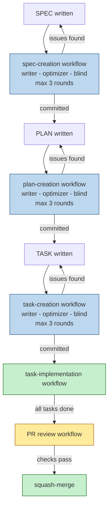
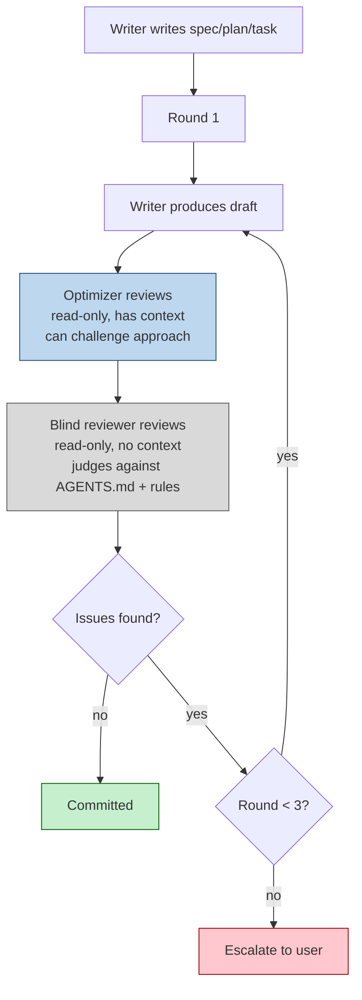
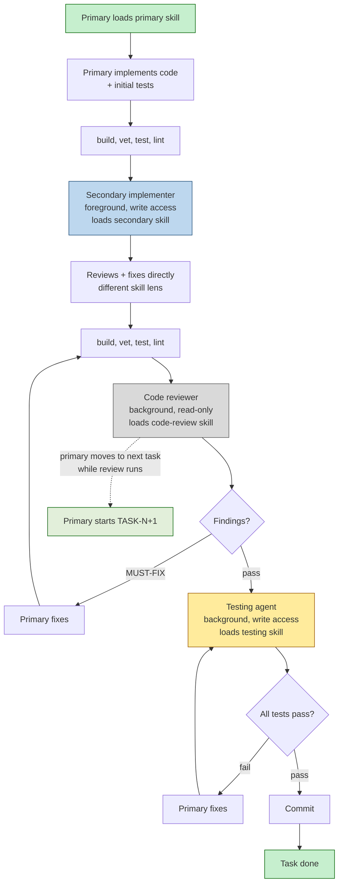
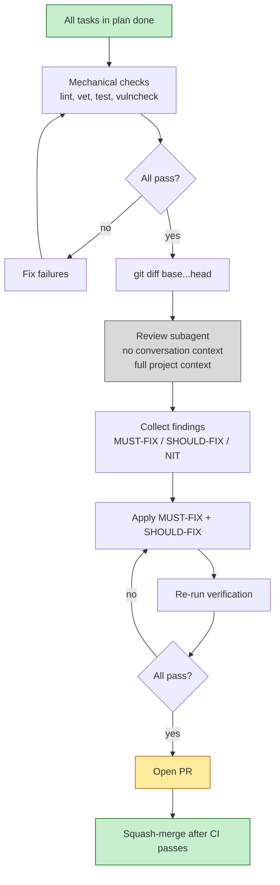

# Workflow Overview

<!-- Mermaid diagrams render inline in GitHub and most IDEs. -->

## Full Lifecycle



## Spec / Plan / Task Creation (shared pattern)



## Task Implementation (assembly line)



## PR Review



## Control Plane

The control plane is the set of rules the orchestrator follows to decide **when to run which skill**, **in what order**, and **how to transition state**. It is not a skill itself — it is the protocol every orchestrator skill implements.

### Trigger conditions

| Skill | Trigger | When to invoke |
|-------|---------|----------------|
| `/spec` | user or model | When a new spec is needed or an existing spec is being revised |
| `/approve-spec` | user or model | After a spec is committed and ready for planning |
| `/plan` | user or model | When an approved spec needs a plan, or a plan needs revision |
| `/approve-plan` | user or model | After a plan is committed and ready for task creation |
| `/create-task` | user or model | When an approved plan needs tasks, or a task needs revision |
| `/implement` | user or model | When a committed task's status is set to `in_progress` |
| `/review` | user or model | When all tasks in a plan are `done` and a PR is ready |
| `/inspect` | user or model | Anytime the agent needs a current view of the xlsx |
| `/context` | model | During orchestration to build a packet for a subagent |
| `/uuid` | model | Whenever a new spec/plan/task needs a UUID |
| `/optimizer` | model only | Spawned by `/create-spec`, `/create-plan`, or `/create-task` during review rounds |
| `/blind-reviewer` | model only | Spawned by `/create-spec`, `/create-plan`, or `/create-task` during review rounds |

### State transitions

Status values flow through the lifecycle:

```
SPEC:    draft → review → committed → approved → done → superseded
PLAN:    draft → review → committed → approved → in_progress → done → superseded
TASK:    draft → review → committed → in_progress → done → superseded
```

- `draft` — document is being written or revised.
- `review` — the document is in the optimizer + blind review loop.
- `committed` — review passed; the document is authoritative.
- `in_progress` — for plans and tasks, implementation has started.
- `done` — all work is complete (tasks) or the spec/plan has been delivered.
- `superseded` — a later version replaces this one; kept for history.

The orchestrator updates the xlsx **after** the step that produced a state change, not before. A task is not set to `done` until all tests pass and the commit is pushed.

### Concurrency rules

1. **Optimizer and blind reviewer can run in parallel** for the same document. They are independent and read-only. The orchestrator spawns both as background subagents, then waits for both results before deciding whether to revise.
2. **Secondary implementer and code reviewer can overlap.** The secondary implementer runs in the foreground; once it finishes, the code reviewer runs in the background while the primary moves on to the next task.
3. **Testing agent runs after code review passes.** It can run in the background; the primary monitors.
4. **No nested subagents by default.** The optimizer and blind reviewer do not spawn their own subagents. Custom profiles can set `max-nesting` if needed, but the default workflow does not use nested subagents.

### Escalation rules

1. **Creation review (spec/plan/task):** max 3 rounds of optimizer + blind reviewer. If the document still has MUST-FIX or SHOULD-FIX issues after round 3, the orchestrator stops and escalates to the user with:
   - The document path
   - The unresolved findings
   - A summary of what has changed across the 3 rounds
   - A recommendation of what to do next
2. **Implementation:** if the primary cannot make build/test pass after 3 fix attempts, escalate. The testing agent failing is not an escalation by itself — keep fixing until green.
3. **PR review:** if mechanical checks fail repeatedly or the review subagent finds security-critical MUST-FIX issues, stop and escalate.

### Failure and retry rules

1. **Subagent fails to start or returns an error.** Do not treat this as a finding. Retry once. If the subagent fails twice, report the error to the user and stop the workflow.
2. **Subagent findings are empty.** If both optimizer and blind reviewer return no findings, the document passes. Do not invent findings.
3. **Subagent returns only NITs.** NITs do not block the round. The orchestrator may apply them or commit the document as-is. Do not spawn another round for NITs alone.
4. **Tool call denied in a background subagent.** Background subagents cannot ask for new permissions. If a subagent fails because a tool was denied, resume it in the foreground or re-run it with the needed permissions.

### Skill loading rules

1. The orchestrator builds a context packet for the target spec/plan/task.
2. The context packet's `allSkills` field lists every skill that applies (cascaded from target → parent → grandparent, deduplicated).
3. The orchestrator loads the primary skill first using `skill invoke --skill <name>`.
4. Secondary skills are loaded later by the appropriate subagent or secondary implementer.
5. The `adhd` skill is loaded during the writer phase for divergent ideation in spec/plan/task creation.

### Exit and hand-off rules

1. A `/create-spec` workflow exits when the spec is committed. It does not auto-start planning. Use `/approve-spec SPEC-NNN` to approve the spec and start `/create-plan`.
2. A `/create-plan` workflow exits when the plan is committed. Use `/approve-plan PLAN-NNN` to approve the plan and start `/create-task` for each task.
3. A `/create-task` workflow exits when all tasks for a plan are committed. It hands off to `/implement` when a task moves to `in_progress`.
4. An `/implement` workflow exits when the task is `done`. It triggers the hook that may spawn the next session.
5. A `/review` workflow exits when the PR is merged or the user aborts.
