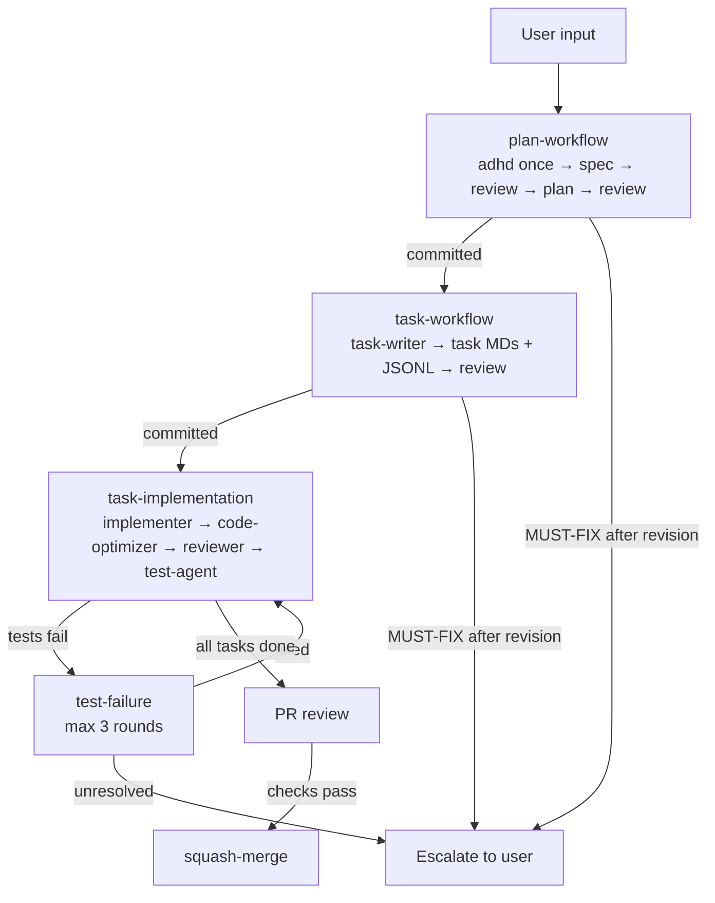
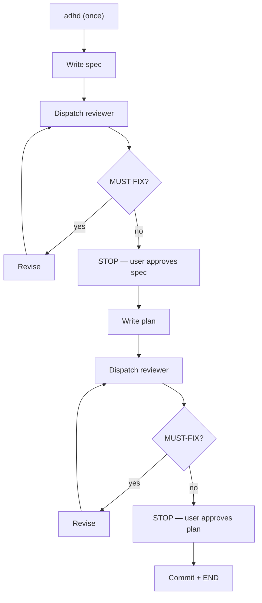
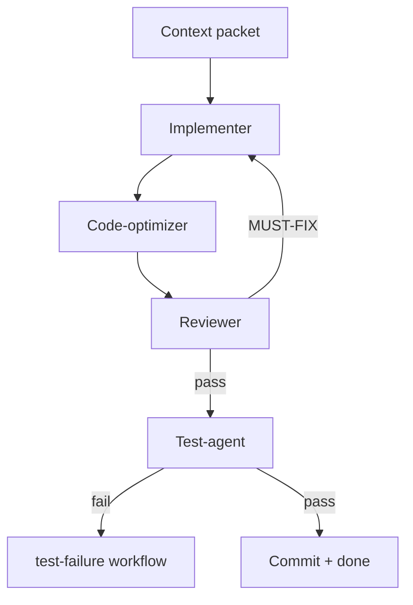

# Workflow Overview

## Full Lifecycle



## Plan Workflow



## Task Implementation



## Control Plane

### Triggers

| Skill | When |
|-------|------|
| `/pc-plan` | User describes what to build |
| `/pc-create-tasks` | After plan committed |
| `/pc-implement` | Task moves to `in_progress` |
| `/pc-review` | All tasks done, PR ready |
| `/pc-inspect-project` | Anytime |
| `/pc-context` | Build a context packet |
| `/pc-uuid` | New spec/plan/task needs UUID |

### State transitions

```
SPEC:    draft → committed → done → superseded
PLAN:    draft → committed → in_progress → done → superseded
TASK:    draft → in_progress → done → superseded
```

### Concurrency

1. One task at a time. No parallel lanes.
2. Subagents run sequentially. Each finishes before the next starts.
3. One review pass per artifact. If MUST-FIX after one revision,
   escalate.

### Escalation

1. Plan/task workflow: one revision, then escalate.
2. Implementation: 3 fix attempts, then escalate.
3. Test failure: 3 rounds, then escalate.
4. PR review: security-critical MUST-FIX, stop and escalate.

### Skill loading

1. `adhd` runs ONCE, by the orchestrator, before the spec.
2. Task-writer does not load `adhd` or any skills.
3. Implementer loads the task's primary skill.
4. Code-optimizer loads the project's language skills.
5. Reviewer loads the project's code-review skill.
6. Test-agent loads the project's testing skill.
