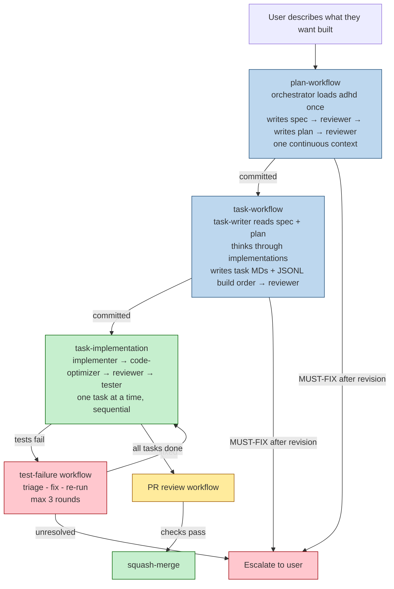
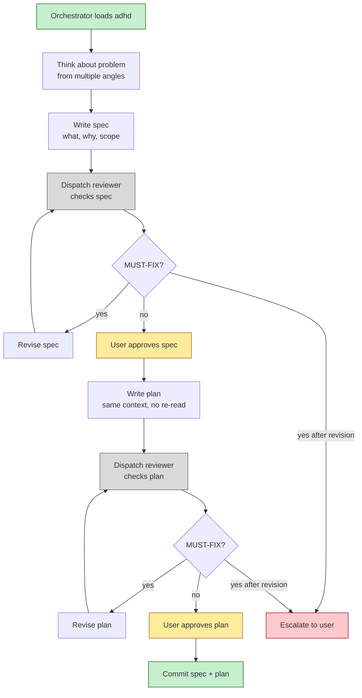
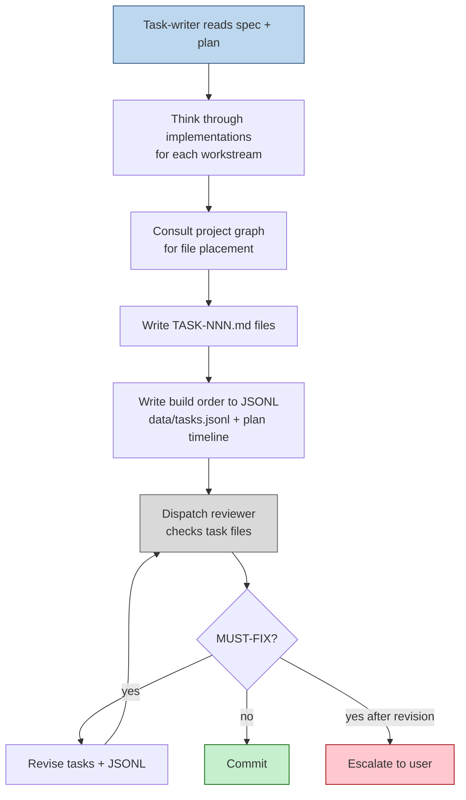
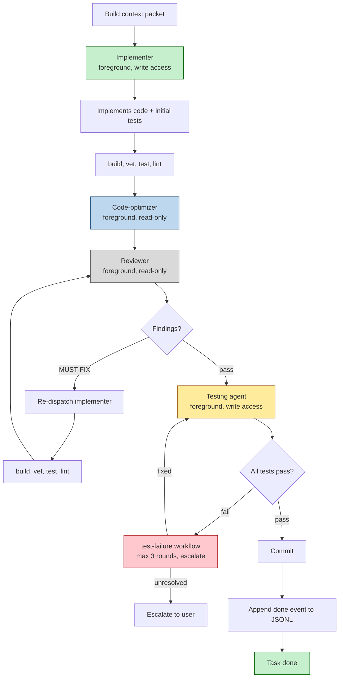
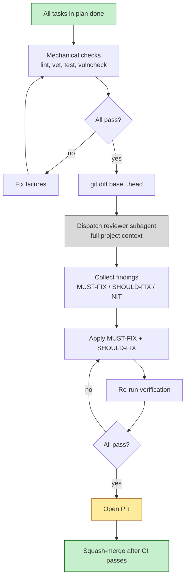

# Workflow Overview

<!-- Mermaid diagrams render inline in GitHub and most IDEs. -->

## Full Lifecycle



## Plan Workflow (spec + plan in one context)



## Task Workflow (task-writer, not orchestrator)



## Task Implementation (one task at a time, sequential)



## PR Review



## Control Plane

### Trigger conditions

| Skill | Trigger | When to invoke |
|-------|---------|----------------|
| `/pc-plan` | user or model | When a user describes what they want built — runs the full spec→plan sequence |
| `/pc-create-tasks` | user or model | After a plan is committed — task-writer reads spec+plan, writes tasks + JSONL |
| `/pc-implement` | user or model | When a committed task's status is set to `in_progress` |
| `/pc-review` | user or model | When all tasks in a plan are `done` and a PR is ready |
| `/pc-inspect-project` | user or model | Anytime the agent needs a current view of the project state |
| `/pc-context` | model | To build a focused context packet for a spec/plan/task |
| `/pc-uuid` | model | Whenever a new spec/plan/task needs a UUID |

### State transitions

Status values flow through the lifecycle:

```
SPEC:    draft → committed → done → superseded
PLAN:    draft → committed → in_progress → done → superseded
TASK:    draft → in_progress → done → superseded
```

- `draft` — document is being written.
- `committed` — review passed; the document is authoritative.
- `in_progress` — for plans and tasks, implementation has started.
- `done` — all work is complete.
- `superseded` — a later version replaces this one; kept for history.

Events are appended to JSONL **after** the step that produced a state
change, not before. A task is not `done` until all tests pass and the
commit is pushed.

### Concurrency rules

1. **One task at a time.** No parallel lanes. The next task does not
   start until the current one is done.
2. **Within a task, subagents run sequentially.** Implementer →
   code-optimizer → reviewer → testing agent. Each step depends on the
   previous one's output. No agent starts until the previous one
   finishes.
3. **The reviewer runs once per artifact.** No 3-round loop. If MUST-FIX
   issues remain after one revision, escalate to the user.

### Escalation rules

1. **Plan workflow:** if the reviewer finds MUST-FIX issues after one
   revision, escalate to the user with the document path, unresolved
   findings, and a recommendation.
2. **Task workflow:** same — one revision, then escalate.
3. **Implementation:** if the implementer cannot make build/test pass
   after 3 fix attempts, escalate. The testing agent failing triggers
   the test-failure workflow — max 3 rounds, then escalate.
4. **PR review:** if mechanical checks fail repeatedly or the reviewer
   finds security-critical MUST-FIX issues, stop and escalate.

### Skill loading rules

1. `adhd` is loaded ONCE, by the orchestrator, before writing the spec.
   Not before the plan, not by the task-writer, not by the reviewer, not
   during implementation.
2. The task-writer does not load `adhd`. The plan already decided the
   approach.
3. The orchestrator builds a context packet for the target task.
4. The implementer loads the task's primary skill.
5. The code-optimizer loads the project's language skills.
6. The reviewer loads the project's code-review skill.
7. The testing agent loads the project's testing skill.

### Exit and hand-off rules

1. The `/pc-plan` workflow exits when the spec and plan are committed. It
   does not auto-start task creation. Use `/pc-create-tasks` to start the
   task workflow.
2. The `/pc-create-tasks` workflow exits when all task files and JSONL are
   committed. It hands off to `/pc-implement` when a task moves to
   `in_progress`.
3. An `/pc-implement` workflow exits when the task is `done`. The hook
   detects the done event in JSONL and tells the orchestrator what to do
   next.
4. A `/pc-review` workflow exits when the PR is merged or the user aborts.
