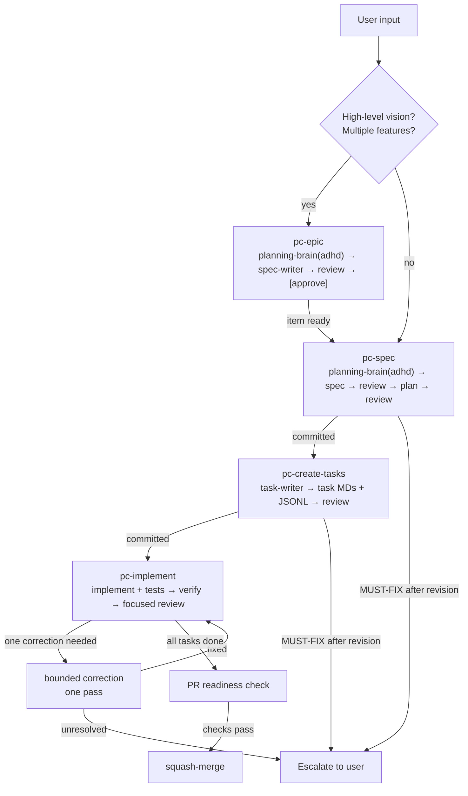
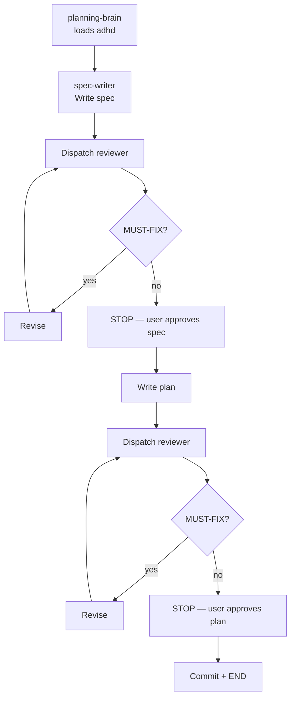
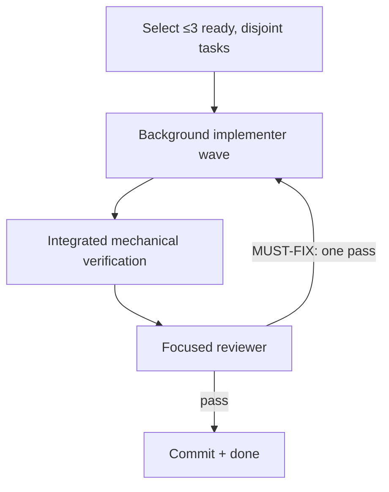

# Workflow Overview

## Full Lifecycle



## Plan Workflow



## Task Implementation



## Control Plane

### Triggers

| Skill | When |
|-------|------|
| `/pc-epic` | User describes a high-level vision with multiple features |
| `/pc-spec` | User describes what to build, or refining a epic item |
| `/pc-create-tasks` | After plan committed |
| `/pc-implement` | Task moves to `in_progress` |
| `/pc-review` | All tasks done, PR ready |
| `/pc-inspect-project` | Anytime |
| `/pc-context` | Build a context packet |
| `/pc-uuid` | New spec/plan/task needs UUID |

### State transitions

```
EPIC: draft → committed → in_progress → done → superseded
SPEC:    draft → committed → done → superseded
PLAN:    draft → committed → in_progress → done → superseded
TASK:    draft → in_progress → done → superseded
```

### Concurrency

1. Up to three dependency-ready implementation tasks with disjoint write sets.
2. Task creation may use up to four pinned read-only analysts in parallel; one
   task-writer serializes every Markdown and JSONL change.
3. Implementers may run as a bounded background wave; reviews and state changes
   remain sequential.
4. One review pass per artifact. If MUST-FIX after one revision,
   escalate.

### Escalation

1. Plan/task workflow: one revision, then escalate.
2. Implementation: one correction pass, then escalate.
3. Test failure: one correction pass, then escalate.
4. PR readiness: checks fail or tasks not done, stop and escalate.

### Skill loading

1. `adhd` is loaded by `planning-brain`, not the orchestrator. Never again after planning.
2. Task-writer does not load `adhd` or any skills.
3. Implementer loads the task's primary skill and `pc-optimize`.
4. Reviewer loads the project's code-review skill.
