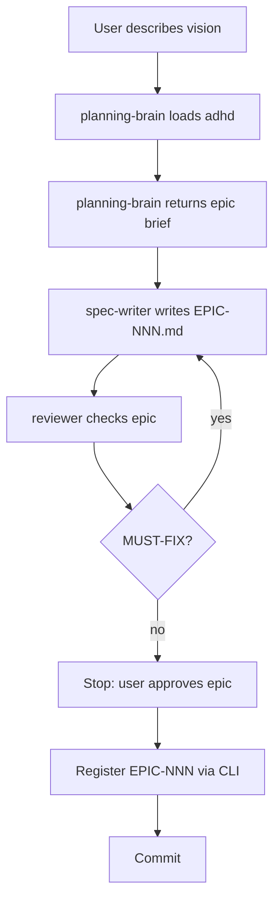

# Workflow: pc-epic

> Write a high-level epic from a user's vision. Items can be vague.
> Each item gets refined into a SPEC when its turn comes via `/pc-plan`.



## CLI

```bash
./tools/project-context add --type epic --title "<title>" -w <workspace> -t .
```

The workspace name is the `.{reponame}-manager` directory. Check the
root `AGENTS.md` for the exact name. Do not guess.

## Steps

1. **Dispatch `planning-brain`** (foreground, `is_background: false`).
   Give it the user's vision and repo context. The planning-brain
   loads `adhd` for divergent ideation, then returns a epic brief:
   - The high-level vision (one paragraph)
   - Ordered items (3-7 items, each a few sentences)
   - Why this order (dependencies between items)
   - Out of scope

2. **Dispatch `spec-writer`** (foreground, `is_background: false`).
   Give it the epic brief. It writes `EPIC-NNN.md` using the
   epic template. Items can be vague — a few sentences each. Later
   items can be vaguer than earlier ones.

3. **Dispatch the reviewer** (foreground, `is_background: false`).
   Give it the epic file. The reviewer checks only:
   - Items are ordered with dependencies explained
   - Each item is a coherent unit of work
   - Out of scope is present
   - Template sections present
   Nothing else. Block on `read_subagent` to collect results.

4. **Apply reviewer findings.** If MUST-FIX issues remain, re-dispatch
   the spec-writer with the findings. At most one correction pass.

5. **Stop. Wait for the user to approve the epic.** Do not register
   or commit until the user says to.

6. **Register the epic via the CLI:**
   ```bash
   ./tools/project-context add --type epic --title "<title>" -w <workspace> -t .
   ```
   Then copy the approved epic content into the generated file.

7. **Commit.** Commit the epic file.

## Refining a epic item into a spec

When the user is ready to build an item from the epic, use
`/pc-plan`. The planning-brain takes the epic item + the epic
for context, and produces a concrete spec for that item. The spec's
`Dependencies` field points to the epic ID (e.g. `EPIC-001`).


The epic tracks which items have been specced. Update the item's
`Status` and `Spec` fields in the epic MD when a spec is created:
- Status: `specced`
- Spec: `SPEC-NNN`
